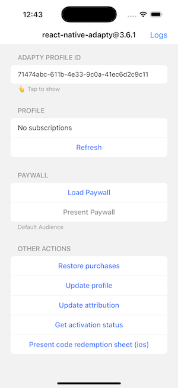
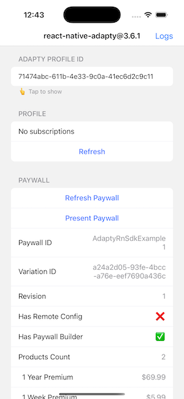

# Adapty React Native SDK example
This app demonstrates basic `react-native-adapty` integration.

## Features
This application demonstrates:
* How to configure an instance of Adapty
* How to check user's purchases and their status (expired/refunded subscriptions)
* How to display a paywall
* How to display a list of products

## 📱 Screenshots

<div align="left">
  
  
  
</div>

## Prerequisites 
This project was created using [React Native CLI](https://reactnative.dev/docs/environment-setup). Make sure you have completed the [Set Up Your Environment](https://reactnative.dev/docs/set-up-your-environment) guide before proceeding.

**For Android Emulator Testing**: Make sure to use an Android emulator with Google Play services installed (look for "Google Play" in the system image name when creating an AVD). This is required for in-app purchases functionality.

## Adapty Configuration

This example uses an automated credential setup system. When you run `yarn start`, the app will automatically prompt you to enter:
- Your Adapty API token
- Placement ID from your dashboard
- iOS Bundle ID
- Android Application ID
   
Your credentials are stored in `.adapty-credentials.json` file (which is gitignored for security).

To force re-enter credentials, run: `yarn credentials-force`

## Getting Started

### Step 1: Install Dependencies

From the project root directory, navigate to the example folder and install dependencies:

```bash
cd examples/AdaptyRnSdkExample
yarn install
```

### Step 2: Install iOS Dependencies (iOS only)

```bash
cd ios
pod install
cd ..
```

### Step 3: Start Metro Bundler

```bash
yarn start
```

> **⚠️ Important:** This will automatically trigger the credential setup if you haven't configured them yet. The app will prompt you to enter your Adapty API token, Placement ID, iOS Bundle ID, and Android Application ID.

### Step 4: Run the Application

Open a new terminal window and run:

**For Android:**
```bash
yarn android
```

**For iOS:**
```bash
yarn ios
```

## 🔧 Troubleshooting

### Credentials Issues
- If you manually edited `.adapty-credentials.json` then run `yarn credentials-force` to re-enter credentials through the interactive setup

### Android Build Issues
- Make sure you're using an emulator with Google Play services
- Clean the build: `cd android && ./gradlew clean && cd ..`
- Reinstall dependencies: `rm -rf node_modules && yarn install`

### iOS Build Issues
- Clean pods: `cd ios && rm -rf Pods Podfile.lock && pod install && cd ..`
- Clean build folder in Xcode: Product → Clean Build Folder


