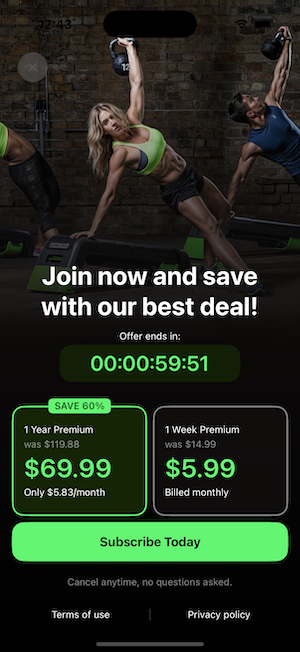

# Adapty React Native SDK example
This app demonstrates basic `react-native-adapty` integration.

## Features
This application demonstrates:
* How to configure an instance of Adapty
* How to check user's purchases and their status (expired/refunded subscriptions)
* How to display a paywall
* How to display a list of products

## 📱 Screenshots

  
  
  

## Prerequisites 
This project was created using [React Native CLI](https://reactnative.dev/docs/environment-setup). Make sure you have completed the [Set Up Your Environment](https://reactnative.dev/docs/set-up-your-environment) guide before proceeding.

**For Android Emulator Testing**: Make sure to use an Android emulator with Google Play services installed (look for "Google Play" in the system image name when creating an AVD). This is required for in-app purchases functionality.

## Adapty Configuration

1. This example uses an automated credential setup system. When you run `yarn start`, the app will automatically prompt you to enter:
   - Your Adapty API token
   - iOS Bundle ID (if different from default)
   
   Your credentials are stored in `.adapty-credentials.json` file (which is gitignored for security).

2. Add placement ID from your dashboard to ./src/constants.ts.

## How to run example with production version of the library
1. Clone this repository
2. In the directory of this example fetch dependencies:
   1. `yarn` to pull node_modules
   2. `bundle exec pod install` (from the root directory) to pull iOS pods. You may need to install `bundle install` before.
   3. For Android you can install dependencies either via Android Studio or with gradle CLI
3. Run `yarn start` to start RN development server. It will automatically run `yarn credentials` to prompt you for your Adapty token and iOS bundle id, then patch the iOS project file with your credentials. You can also run `yarn credentials` manually if needed.
4. Now you can run the example on a device:
   - **For iOS**: Make sure to start the development server with `yarn start` first before running `yarn ios`
   - **For Android**: Run `yarn android`

## How to run example with local version of the library

As symlinks do not work with React Native, we recommend using [wml](https://github.com/wix/wml).

0. `npm install -g wml` to install *wml*
1. Clone this repository
2. In the root directory of this library compile the library with `yarn build` or setup continuous compilation with `yarn watch` (watches your changes and compiles them to JS)
3. In the directory of this example fetch dependencies:
   1. `yarn` to pull node_modules
   2. `bundle exec pod install` (from the root directory) to pull iOS pods
   3. For Android you can install dependencies either via Android Studio or with gradle CLI
4. In the root of the library run `wml add . examples/AdaptyRnSdkExample/node_modules/react-native-adapty` to create a *wml* link
5. Run `wml start` to watch JS library code changes
6. Run `yarn start` to start RN development server. It will prompt you to insert your Adapty token and iOS bundle id. If you have automated flow and you don't run `start` command, you can optionally run `yarn credentials` to provide your private data
7. Now you can run the example on a device with your preferred method
