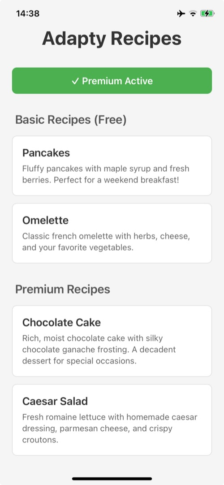
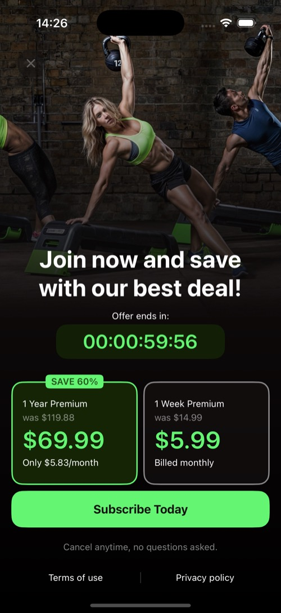

## Adapty React Native Basic Example

This is a minimal example application demonstrating the core functionality of Adapty React Native SDK:

- SDK activation
- Displaying free and premium content
- Showing paywall for premium content access
- Making purchases through Paywall Builder
- Automatic access to premium content after successful purchase

### Features

- **Basic Recipes** - Free content available to all users
- **Premium Recipes** - Content requiring an active subscription
- **Paywall Builder Integration** - Native paywall presentation
- **Real-time Access Updates** - Automatic unlock after purchase

### Screenshots

<p float="left">
  
  
  
</p>

## Requirements

- Node 20
- JDK 21
- Xcode (for iOS)
- Android Studio (for Android)

## Setup

Before running the app, make sure you have configured your Adapty credentials:

1. Run `yarn install` to install dependencies
2. The `yarn credentials` command will run automatically before start (prestart hook) to set up your Adapty configuration
   - This script creates `.adapty-credentials.json` file and configures native projects (bundle IDs, application IDs)
   - If you need to update credentials later, run `yarn credentials-force` to force update
3. The credentials file `.adapty-credentials.json` should contain:
   - `token` - Your Adapty public SDK key
   - `placement_id` - Placement ID for the paywall from the dashboard
   - `ios_bundle` - iOS bundle identifier (must match your App Store Connect configuration)
   - `android_application_id` - Android application ID (must match your Google Play Console configuration)
   
   ⚠️ **Important**: Bundle IDs must match your app configuration in App Store Connect (iOS) and Google Play Console (Android). Without correct bundle IDs, you won't be able to make test purchases.

## Running this example

### Running on iOS

To run on iOS simulator:

```bash
yarn ios
```

Or open Xcode:

```bash
npx react-native run-ios
```

### Running on Android

To run on Android device or emulator:

```bash
yarn android
```

Or open Android Studio and build from there.

## How It Works

1. **SDK Activation** - The app activates Adapty SDK on startup using credentials from `.adapty-credentials.json`
2. **Profile Loading** - User profile is fetched to check subscription status
3. **Paywall Loading** - Paywall is preloaded for quick presentation
4. **Content Access** - Free recipes are always accessible, premium recipes require active subscription
5. **Purchase Flow** - When user taps a locked recipe, the paywall is presented using Paywall Builder
6. **Access Grant** - After successful purchase, profile is updated and premium content becomes accessible

## Testing Purchases

To test the purchase flow:

1. Make sure you have configured test products in Adapty Dashboard
2. Use test accounts:
   - **iOS**: Sandbox Tester account (configured in App Store Connect)
   - **Android**: Gmail account added to License Testers list in Google Play Console
3. Tap on any premium recipe (🔒 icon)
4. Complete the purchase in the presented paywall
5. Premium content will unlock automatically

## Development

### Update SDK from local sources

If you're developing the SDK and want to test changes in this example:

```bash
yarn update-sdk-full
```

This script will:
1. Build the SDK from the parent directory
2. Create a package archive
3. Install it directly into this example's `node_modules`
