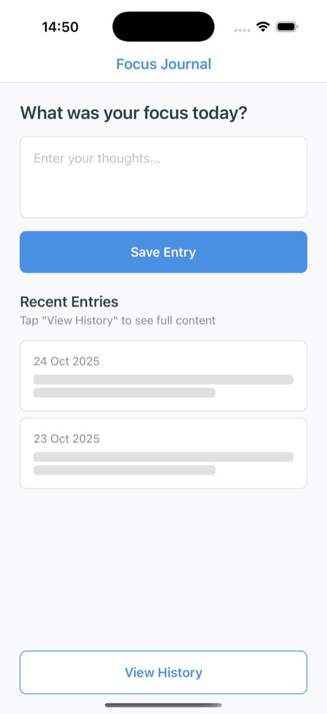
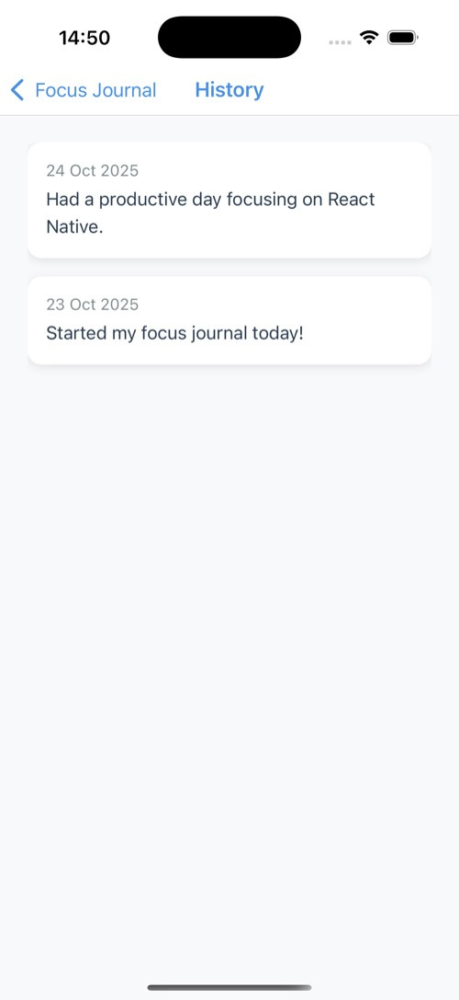

# Focus Journal for React Native with Expo

This repository demonstrates how to integrate the [Adapty SDK](https://adapty.io) into an existing React Native app built with Expo. It supports both local builds and EAS Cloud builds. It contains two branches:

- **`starter`**: A “clean slate” version of the Focus Journal app with no Adapty code included. Use this branch to follow the Quickstart guide and add Adapty yourself.
- **`master`**: The fully integrated version, showing the completed Adapty integration for reference.

---

## Table of Contents

1. [Project Overview](#project-overview)  
2. [Branch Structure](#branch-structure)  
3. [Prerequisites](#prerequisites)  
4. [Getting Started](#getting-started)  
5. [Running Locally](#running-locally)  
6. [Running with EAS Build](#running-with-eas-build)  

---

## Project Overview

**Focus Journal** is a simple journaling app that lets users log daily entries and view their history. In the “premium” flow, tapping “History” triggers a paywall if the user is not subscribed. The Adapty SDK is used to:

1. **Activate Adapty at launch**  
2. **Fetch the user’s profile and determine access**  
3. **Display a customizable paywall UI using Paywall Builder**  
4. **Handle purchase and restore callbacks**  

You can follow along on the `feat/focus-journal-expo-starter` branch to add Adapty manually, or inspect the `master` branch to see the final result.

You can also follow along with the video tutorial:

[](https://www.youtube.com/watch?v=TtCJswpt2ms)

### Screenshots

<p float="left">
  
  
</p>

---

## Branch Structure

- **`feat/focus-journal-expo-starter`**  
  - Contains the Focus Journal app without any Adapty code.  
  - Meant as a starting point for following the Quickstart guide.  

- **`master`**  
  - Contains the same app with Adapty fully integrated.  
  - Compare this branch to `starter` to see the complete implementation.  

---

## Prerequisites

> **Note:** This app requires a custom development build. Expo Go will **not** work because the Adapty SDK includes native dependencies.

### Common Requirements
- **Node.js** (version 20 or higher)
- A valid **Adapty account** with an SDK key
- At least one in-app purchase configured in App Store Connect (iOS) or Google Play Console (Android) and synced to Adapty
- **Physical device** is recommended for testing in-app purchases

### For Local Builds
- Xcode
- Android Studio

### For EAS Cloud Builds
- EAS CLI
- An Expo account  

---

## Getting Started

1. **Clone this repository**  
   ```bash
   git clone https://github.com/adaptyteam/AdaptySDK-React-Native.git
   cd examples/FocusJournalExpo
   ```

2. **Check out the starter branch**  
   ```bash
   git checkout feat/focus-journal-expo-starter
   ```

3. **Follow the Quickstart Integration Guide to add Adapty step-by-step.**

4. When you're done, or if you get stuck, switch to the `master` branch to compare your work:  
   ```bash
   git checkout master
   ```

---

## Running Locally

To test in-app purchases with your own Apple/Google accounts, you need to configure your own app bundle identifier and package name:

1. **Install dependencies**:
   ```bash
   git checkout master
   npm install
   ```

2. **Update `app.json`** with your own identifiers:
   ```json
   {
     "expo": {
       "ios": {
         "bundleIdentifier": "com.yourcompany.focusjournal"
       },
       "android": {
         "package": "com.yourcompany.focusjournal"
       }
     }
   }
   ```

3. **Regenerate native projects** with the new identifiers:
   ```bash
   npx expo prebuild --clean
   ```
   

4. **Add your Adapty API key and PLACEMENT_ID** to `AdaptyConstants.js`:
   ```javascript
   export default {
     API_KEY: "public_live_YOUR_KEY_HERE",
     ACCESS_LEVEL_ID: "premium",
     PLACEMENT_ID: "your_placement_id",
   };
   ```

5. **Run the app locally** using npm scripts:
   ```bash
   # For iOS
   npm run ios:preview

   # For Android
   npm run android:preview
   ```
   
   These commands will build and launch the app with bundled JavaScript on your device or simulator/emulator. No need to run the Metro bundler separately.

Note: You'll need the products, placements, and paywalls already defined in your Adapty dashboard. See [the Adapty docs](https://adapty.io/docs/) for help.

You should now have a working Adapty integration in a React Native app using Expo. Feel free to explore the master branch to see the completed integration or continue customizing the UI.

---

## Running with EAS Build

Follow steps 1-4 from [Running Locally](#running-locally) section, then:

1. **Configure EAS Build** (if not done yet):
   
   Follow the [official EAS Build setup guide](https://docs.expo.dev/tutorial/eas/configure-development-build/) to install EAS CLI, login and registered iOS devices.

2. **Build your dev client with EAS**:
   ```bash
   # Build for iOS
   eas build --profile development --platform ios

   # Build for Android
   eas build --profile development --platform android
   ```

   Once the build completes, install it on your device or simulator.

3. **Start the dev client**:
   ```bash
   npx expo start --dev-client
   ```

If you find any mistakes or have questions, please open an issue or submit a pull request. Happy coding!
