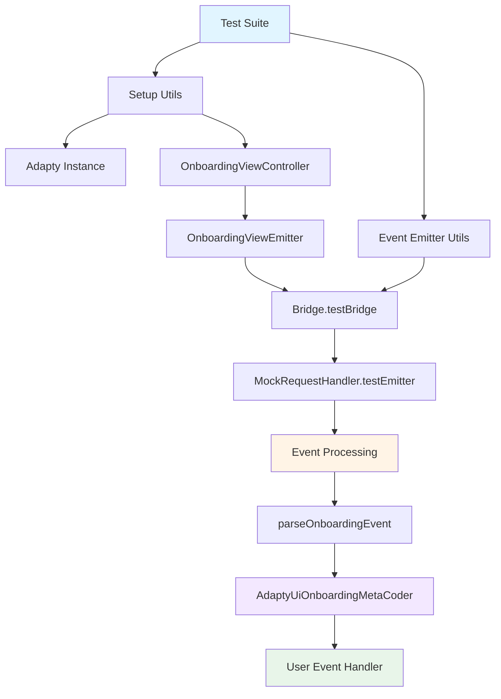
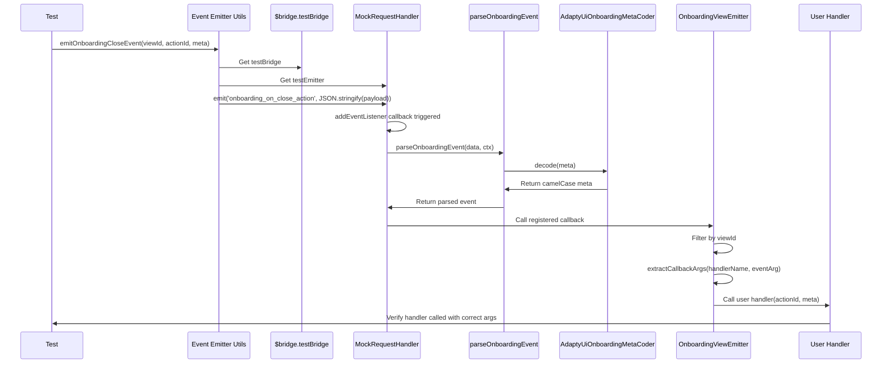

# UI View Controllers Integration Tests

This directory contains integration tests for UI view controllers event handling in the Adapty SDK.

## Overview

These tests verify that view controller event handlers work correctly with the mock bridge, ensuring that:
- Events are emitted properly through the mock infrastructure
- Event handlers receive correctly formatted data
- Meta information is properly decoded from snake_case to camelCase
- Events are filtered by view ID

## Architecture

The testing infrastructure consists of three main components:



## Components

### 1. Setup Utils (`setup.utils.ts`)

Provides helper functions for test setup and teardown:

- **`createOnboardingViewController()`**: Creates an Adapty instance in mock mode and initializes an OnboardingViewController
- **`cleanupOnboardingViewController()`**: Cleans up resources after tests

```typescript
const { adapty, view } = await createOnboardingViewController();
// ... run tests
cleanupOnboardingViewController(view, adapty);
```

### 2. Event Emitter Utils (`event-emitter.utils.ts`)

Provides functions to emit mock native events for testing:

- **`emitOnboardingCloseEvent()`**: Emits a mock `onboarding_on_close_action` event with proper payload structure

The utility:
1. Gets access to the mock bridge via `$bridge.testBridge`
2. Gets access to the internal emitter via `.testEmitter`
3. Constructs a properly formatted event payload with:
   - `id`: Event identifier (required for parsing)
   - `view`: View reference with ID
   - `action_id`: Action identifier
   - `meta`: Metadata in snake_case format
4. Emits the event as a JSON string (mimicking native behavior)

### 3. Test Suite (`onboarding-view-controller-events.test.ts`)

Contains integration tests for onboarding view controller events.

#### Current Test Cases

**Test: "should call onClose handler when native event is emitted"**
- Creates a view and sets up an event handler
- Emits a mock native event
- Verifies the handler is called with correctly formatted arguments
- Confirms meta is converted from snake_case to camelCase

**Test: "should filter events by viewId"**
- Creates a view and sets up an event handler
- Emits an event for a different view ID
- Verifies the handler is NOT called (event filtering works)

## Event Flow



## Data Format Transformation

### Input (Native Format - snake_case)

```json
{
  "id": "onboarding_on_close_action",
  "view": { "id": "mock-onboarding-abc123" },
  "action_id": "close_button_1",
  "meta": {
    "onboarding_id": "test_onboarding_123",
    "screen_cid": "welcome_screen",
    "screen_index": 0,
    "total_screens": 3
  }
}
```

### Output (JavaScript Format - camelCase)

```typescript
handler(
  "close_button_1",
  {
    onboardingId: "test_onboarding_123",
    screenClientId: "welcome_screen",
    screenIndex: 0,
    totalScreens: 3
  }
)
```

## Key Features

### 1. Mock Bridge Access

Tests use internal getters for testing:
- `$bridge.testBridge` - Access to the bridge instance
- `MockRequestHandler.testEmitter` - Access to the event emitter

These getters are marked as `@internal` and are only for testing purposes.

### 2. Event Parsing Pipeline

The `MockRequestHandler.addEventListener` implements the same parsing pipeline as `NativeRequestHandler`:

1. **Common Events**: `parseCommonEvent()` - for profile and installation events
2. **Onboarding Events**: `parseOnboardingEvent()` - for onboarding events with meta decoding
3. **Paywall Events**: `parsePaywallEvent()` - for paywall events (fallback)

### 3. Meta Decoding

The `parseOnboardingEvent` function uses `AdaptyUiOnboardingMetaCoder` to automatically decode meta from snake_case to camelCase, ensuring consistency with native platform behavior.

### 4. View ID Filtering

Events are filtered by view ID to ensure that only events intended for a specific view instance are processed. This prevents cross-contamination when multiple views are active.

## Running Tests

```bash
# Run all UI integration tests
yarn test src/__tests__/integration/ui

# Run specific test file
yarn test src/__tests__/integration/ui/onboarding-view-controller-events.test.ts

# Run with watch mode
yarn test --watch src/__tests__/integration/ui
```

## Extending Tests

### Adding New Event Types

To test additional event types:

1. Create a new emit function in `event-emitter.utils.ts`:
```typescript
export function emitOnboardingAnalyticsEvent(
  viewId: string,
  event: { name: string; element_id?: string },
  meta: AdaptyUiOnboardingMeta,
): void {
  // Implementation
}
```

2. Add test cases in `onboarding-view-controller-events.test.ts`:
```typescript
it('should call onAnalytics handler', async () => {
  const handler = jest.fn();
  view.setEventHandlers({ onAnalytics: handler });
  
  emitOnboardingAnalyticsEvent(viewId, { name: 'screen_view' }, meta);
  
  await new Promise(resolve => setTimeout(resolve, 50));
  expect(handler).toHaveBeenCalled();
});
```

### Adding Paywall Event Tests

Create similar test files for `ViewController` (paywall events):
- `view-controller-events.test.ts`
- Add paywall-specific emit functions to `event-emitter.utils.ts`
- Use the same architecture and patterns

## Technical Details

### Async Event Processing

Tests use a small timeout to ensure async event processing completes:

```typescript
await new Promise(resolve => setTimeout(resolve, 50));
```

This is necessary because:
1. Event emission is synchronous
2. But event handler invocation may involve async operations
3. The 50ms delay ensures all callbacks complete before assertions

### Type Safety

The implementation maintains full TypeScript type safety:
- Event payloads are properly typed
- Meta transformations preserve types
- Handler signatures are verified at compile time

## Troubleshooting

### Handler Not Called

If a handler is not being called:
1. Verify the `id` field is present in the event payload
2. Check that the view ID matches
3. Ensure the event name matches the expected native event name
4. Add logging in `MockRequestHandler.addEventListener` to debug

### Incorrect Data Format

If data format is incorrect:
1. Verify `parseOnboardingEvent` is being called
2. Check that the coder is decoding properties correctly
3. Ensure the payload structure matches the native format

### Test Timeout

If tests time out:
1. Increase the async wait time
2. Check for infinite loops in event handlers
3. Verify cleanup is happening properly

## Future Improvements

- [ ] Add tests for all onboarding event types
- [ ] Create similar test suite for paywall events
- [ ] Add tests for error scenarios
- [ ] Add tests for multiple handlers on the same view
- [ ] Add tests for unsubscribe functionality
- [ ] Add integration with real event payloads from logs

