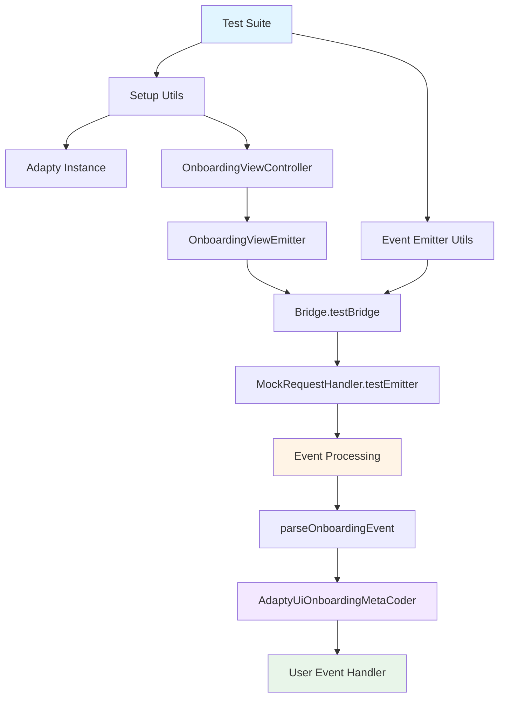
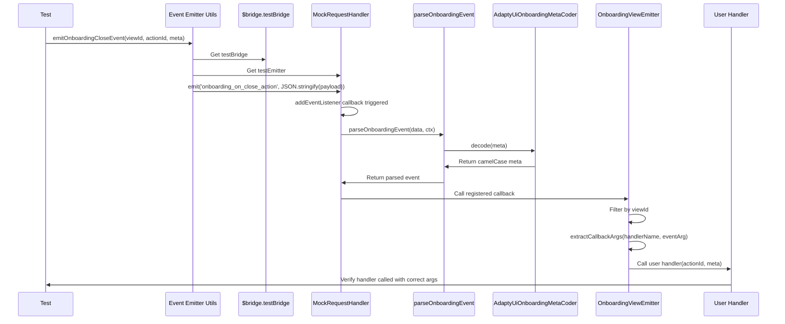

# UI View Controllers Integration Tests

This directory contains integration tests for UI view controllers event handling in the Adapty SDK.

## Overview

These tests verify that view controller event handlers work correctly with the mock bridge, ensuring that:
- Events are emitted properly through the mock infrastructure in native format (snake_case)
- Event handlers receive correctly formatted data (camelCase)
- Meta information is properly decoded from snake_case to camelCase
- Events are filtered by view ID

Event samples in [`bridge-event-samples.ts`](/Users/stanislavmayorov/projects/AdaptySDK-React-Native/src/__tests__/integration/ui/bridge-event-samples.ts) use native format (snake_case) to match real bridge events.

## Test Organization

This directory contains two types of integration tests, organized by controller type:

```
ui/
├── paywall/
│   ├── events/   # Event handling tests for ViewController
│   └── methods/  # Bridge communication tests for ViewController
└── onboarding/
    ├── events/   # Event handling tests for OnboardingViewController
    └── methods/  # Bridge communication tests for OnboardingViewController
```

### 1. Event Handling Tests (`*/events/` subdirectories)

**Purpose:** Test event emission and parsing
**Approach:** Use MockRequestHandler with testEmitter
**Files:**
- `paywall/events/*-events.test.ts` - Paywall event handlers (3 files)
- `onboarding/events/onboarding-view-controller-events.test.ts` - Onboarding event handlers

**What they test:**
- Events emitted from native are parsed correctly (snake_case → camelCase)
- Event handlers receive correct data
- Event filtering by viewId
- Default handlers behavior

### 2. UI Methods Tests (`*/methods/` subdirectories)

**Purpose:** Test bridge communication for UI controller methods
**Approach:** Use NativeModuleMock (same as adapty-handler tests)
**Files:**
- `paywall/methods/paywall-view-controller-methods.test.ts` - Paywall UI methods (7 tests)
- `onboarding/methods/onboarding-paywall-view-controller-methods.test.ts` - Onboarding UI methods (4 tests)

**What they test:**
- Request encoding (camelCase → snake_case)
- Response parsing (snake_case → camelCase)
- Parameter handling (prefetchProducts, loadTimeoutMs, iOS styles)

Both types are **complementary**:
- Events tests ensure event handling works
- Methods tests ensure bridge communication is correct

## Shared Utilities

UI tests use shared utilities from `../shared/`:
- `native-module-mock.utils.ts` - Native module mocking (for methods tests)
- `bridge-samples/ui-methods.ts` - UI methods request/response samples

See [../shared/README.md](../shared/README.md) for details.

## Architecture

The testing infrastructure consists of three main components:


```mermaid
graph TD
    Test[Test Suite] --> Setup[Setup Utils]
    Test --> EventEmitter[Event Emitter Utils]
    
    Setup --> Adapty[Adapty Instance]
    Setup --> ViewController[OnboardingViewController]
    
    EventEmitter --> Bridge[Bridge.testBridge]
    Bridge --> MockEmitter[MockRequestHandler.testEmitter]
    
    MockEmitter --> EventProcessor[Event Processing]
    EventProcessor --> Parser[parseOnboardingEvent]
    Parser --> Decoder[AdaptyUiOnboardingMetaCoder]
    Decoder --> Handler[User Event Handler]
    
    ViewController --> ViewEmitter[OnboardingViewEmitter]
    ViewEmitter --> Bridge
    
    style Test fill:#e1f5ff
    style EventProcessor fill:#fff4e6
    style Decoder fill:#f3e8ff
    style Handler fill:#e8f5e9
```

## Components

### 1. Setup Utils (`setup.utils.ts`)

Provides helper functions for test setup and teardown:

- **`createOnboardingViewController()`**: Creates an Adapty instance in mock mode and initializes an OnboardingViewController
- **`cleanupOnboardingViewController()`**: Cleans up resources after tests

```typescript
const { adapty, view } = await createOnboardingViewController();
// ... run tests
cleanupOnboardingViewController(view, adapty);
```

### 2. Event Emitter Utils (`event-emitter.utils.ts`)

Provides functions to emit mock native events for testing:

- **`emitOnboardingCloseEvent()`**: Emits a mock `onboarding_on_close_action` event with proper payload structure

The utility:
1. Gets access to the mock bridge via `$bridge.testBridge`
2. Gets access to the internal emitter via `.testEmitter`
3. Constructs a properly formatted event payload with:
   - `id`: Event identifier (required for parsing)
   - `view`: View reference with ID
   - `action_id`: Action identifier
   - `meta`: Metadata in snake_case format
4. Emits the event as a JSON string (mimicking native behavior)

### 3. Test Suite (`onboarding-view-controller-events.test.ts`)

Contains integration tests for onboarding view controller events.

#### Current Test Cases

**Test: "should call onClose handler when native event is emitted"**
- Creates a view and sets up an event handler
- Emits a mock native event
- Verifies the handler is called with correctly formatted arguments
- Confirms meta is converted from snake_case to camelCase

**Test: "should filter events by viewId"**
- Creates a view and sets up an event handler
- Emits an event for a different view ID
- Verifies the handler is NOT called (event filtering works)

## Event Flow


```mermaid
sequenceDiagram
    participant Test
    participant EventUtils as Event Emitter Utils
    participant Bridge as $bridge.testBridge
    participant MockEmitter as MockRequestHandler
    participant Parser as parseOnboardingEvent
    participant Decoder as AdaptyUiOnboardingMetaCoder
    participant ViewEmitter as OnboardingViewEmitter
    participant Handler as User Handler
    
    Test->>EventUtils: emitOnboardingCloseEvent(viewId, actionId, meta)
    EventUtils->>Bridge: Get testBridge
    EventUtils->>MockEmitter: Get testEmitter
    EventUtils->>MockEmitter: emit('onboarding_on_close_action', JSON.stringify(payload))
    
    MockEmitter->>MockEmitter: addEventListener callback triggered
    MockEmitter->>Parser: parseOnboardingEvent(data, ctx)
    Parser->>Decoder: decode(meta)
    Decoder->>Parser: Return camelCase meta
    Parser->>MockEmitter: Return parsed event
    
    MockEmitter->>ViewEmitter: Call registered callback
    ViewEmitter->>ViewEmitter: Filter by viewId
    ViewEmitter->>ViewEmitter: extractCallbackArgs(handlerName, eventArg)
    ViewEmitter->>Handler: Call user handler(actionId, meta)
    Handler->>Test: Verify handler called with correct args
```

## Data Format Transformation

### Input (Native Format - snake_case)

```json
{
  "id": "onboarding_on_close_action",
  "view": { "id": "mock-onboarding-abc123" },
  "action_id": "close_button_1",
  "meta": {
    "onboarding_id": "test_onboarding_123",
    "screen_cid": "welcome_screen",
    "screen_index": 0,
    "total_screens": 3
  }
}
```

### Output (JavaScript Format - camelCase)

```typescript
handler(
  "close_button_1",
  {
    onboardingId: "test_onboarding_123",
    screenClientId: "welcome_screen",
    screenIndex: 0,
    totalScreens: 3
  }
)
```

## Key Features

### 1. Mock Bridge Access

Tests use internal getters for testing:
- `$bridge.testBridge` - Access to the bridge instance
- `MockRequestHandler.testEmitter` - Access to the event emitter

These getters are marked as `@internal` and are only for testing purposes.

### 2. Event Parsing Pipeline

The `MockRequestHandler.addEventListener` implements the same parsing pipeline as `NativeRequestHandler`:

1. **Common Events**: `parseCommonEvent()` - for profile and installation events
2. **Onboarding Events**: `parseOnboardingEvent()` - for onboarding events with meta decoding
3. **Paywall Events**: `parsePaywallEvent()` - for paywall events (fallback)

### 3. Meta Decoding

The `parseOnboardingEvent` function uses `AdaptyUiOnboardingMetaCoder` to automatically decode meta from snake_case to camelCase, ensuring consistency with native platform behavior.

### 4. View ID Filtering

Events are filtered by view ID to ensure that only events intended for a specific view instance are processed. This prevents cross-contamination when multiple views are active.

## Running Tests

```bash
# Run all UI integration tests
yarn test src/__tests__/integration/ui

# Run specific controller type tests
yarn test src/__tests__/integration/ui/paywall
yarn test src/__tests__/integration/ui/onboarding

# Run specific test category
yarn test src/__tests__/integration/ui/paywall/events
yarn test src/__tests__/integration/ui/paywall/methods

# Run specific test file
yarn test src/__tests__/integration/ui/onboarding/events/onboarding-view-controller-events.test.ts
yarn test src/__tests__/integration/ui/paywall/methods/paywall-view-controller-methods.test.ts

# Run with watch mode
yarn test --watch src/__tests__/integration/ui
```

## Extending Tests

### Adding New Event Types

To test additional event types:

1. Add event sample in `bridge-event-samples.ts` (use snake_case for native format):
```typescript
export const NEW_EVENT_SAMPLES = {
  exampleEvent: {
    id: 'event_name',
    view: { id: '...', variation_id: '...', placement_id: '...' },
    meta: { onboardingId: '...', screenClientId: '...', ... },
    // event-specific fields in snake_case
    // Note: view fields are parsed to camelCase (variationId, placementId) by parseOnboardingEvent
  },
};
```

2. Create emit function in `event-emitter.utils.ts` that formats payload in native format

3. Add test cases in appropriate test file that verify handler receives camelCase data

### Adding New UI Methods Tests

To add tests for new UI methods:

1. Add bridge samples in `../shared/bridge-samples/ui-methods.ts`:
```typescript
export const ADAPTY_UI_NEW_METHOD_REQUEST: components['requests']['NewMethod.Request'] = {
  method: 'adapty_ui_new_method',
  // ... fields in snake_case
};
```

2. Extend `ResponseRegistry` in `../shared/native-module-mock.utils.ts`:
```typescript
interface ResponseRegistry {
  // ... existing methods
  adapty_ui_new_method?: components['requests']['NewMethod.Response'];
}
```

3. Add test cases in `paywall/methods/` or `onboarding/methods/` that verify:
   - Request encoding (camelCase → snake_case)
   - Response parsing (snake_case → camelCase)

## Technical Details

### Async Event Processing

Tests use a small timeout to ensure async event processing completes:

```typescript
await new Promise(resolve => setTimeout(resolve, 50));
```

This is necessary because:
1. Event emission is synchronous
2. But event handler invocation may involve async operations
3. The 50ms delay ensures all callbacks complete before assertions

### Type Safety

The implementation maintains full TypeScript type safety:
- Event payloads are properly typed
- Meta transformations preserve types
- Handler signatures are verified at compile time

## Troubleshooting

### Handler Not Called

If a handler is not being called:
1. Verify the `id` field is present in the event payload
2. Check that the view ID matches
3. Ensure the event name matches the expected native event name
4. Add logging in `MockRequestHandler.addEventListener` to debug

### Incorrect Data Format

If data format is incorrect:
1. Verify `parseOnboardingEvent` is being called
2. Check that the coder is decoding properties correctly
3. Ensure the payload structure matches the native format

### Test Timeout

If tests time out:
1. Increase the async wait time
2. Check for infinite loops in event handlers
3. Verify cleanup is happening properly

## Test Coverage

### Event Handling Tests

**Paywall Events** (`paywall/events/`):
- 3 test files covering all paywall event types
- Platform-specific tests (iOS, Android)
- Cross-platform event tests

**Onboarding Events** (`onboarding/events/`):
- All 7 onboarding event types covered:
  1. **onClose** - 2 tests (basic + filtering)
  2. **onAnalytics** - 1 test
  3. **onStateUpdated** - 9 tests covering all input types
  4. **onFinishedLoading** - 1 test
  5. **onPaywall** - 1 test
  6. **onCustom** - 1 test
  7. **onError** - 1 test
- Total: **16 tests** covering all onboarding event types and their variations

### UI Methods Tests

**Paywall UI Methods** (`paywall/methods/paywall-view-controller-methods.test.ts`):
- 7 tests covering:
  - `createPaywallView()` - default and custom parameters
  - `present()` - full_screen and page_sheet styles
  - `dismiss()` - request format
  - `showDialog()` - full and minimal configurations

**Onboarding UI Methods** (`onboarding/methods/onboarding-paywall-view-controller-methods.test.ts`):
- 4 tests covering:
  - `createOnboardingView()` - default and custom parameters
  - `present()` - iOS presentation style
  - `dismiss()` - request format

**Total: 11 UI methods tests** verifying bridge communication

## Future Improvements

- [ ] Add tests for error scenarios in methods tests (error responses from bridge)
- [ ] Add tests for edge cases in methods tests (null/undefined parameters)
- [ ] Add performance tests for event handling with many subscribers

